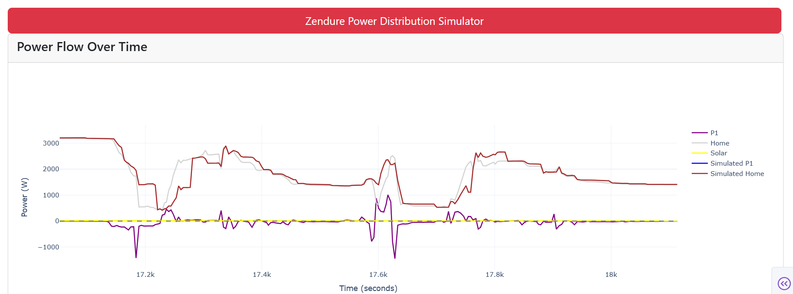

# ZendureSimulator

A Python Plotly Dash application for simulating Zendure battery systems. This interactive web application allows you to visualize and analyze the power distribution

## example


## Requirements

- Python 3.8 or higher
- Dependencies listed in `requirements.txt`

## Installation

1. Clone the repository:
```bash
git clone https://github.com/FireSon/ZendureSimulator.git
cd ZendureSimulator
```

2. Install the required packages:
```bash
pip install -r requirements.txt
```

## Usage

1. Run the application:
```bash
python app.py
```

2. Open your web browser and navigate to:
```
http://localhost:8050
```

## Application Components

## License

MIT License - See LICENSE file for details

## Author

FireSon

## Contributing

Contributions are welcome! Please feel free to submit a Pull Request.