# Simulation Architecture for Zendure Device Control

This document describes how to build a simulation environment that mimics the behavior of Zendure energy devices (SolarFlow, Hub, Hyper, ACE, etc.) using Home Assistant data and exported log files.  
The goal is to provide a reproducible environment for testing control strategies, automation logic, and energy‑flow calculations.

The simulation focuses on:

- Which **sensors and data points** are required  
- Which values can be **derived or calculated**  
- Which device properties are **static** and must be known in advance  
- How to model **special cases** such as Off‑Grid ports or devices controlled only through a Hub  
- How to structure the **data flow** between components

## 1. Core Concept

A Zendure simulation models the **energy flow** between:

- PV input  
- Batteries  
- Grid import/export  
- AC output ports (On‑Grid, Off‑Grid)  
- Device‑to‑device connections (e.g., Hub → ACE 1500)  

The simulator consumes **time‑series data** from log files or Home Assistant sensors and produces a virtual state for each device at each timestep.


## 2. Required Sensor Data
To simulate Zendure devices accurately, the following categories of data are required.
Not all devices provide all sensors; missing values can often be derived.

### 2.1 Home consumption

Household consumption (homeC) serves as a reference value. This is the power consumption displayed by the electricity meter when no Zendure devices are present. The power consumption of this sensor includes:
* Total load of all electricity consumers in the household
* external PV input
* all offGrid load

Here some possible scenarios: 

With Zendure devices (ZD)


We don't know the total home consumption and also not the power of the external PV. We only can drive the homeC value from the log file. The different scenarios illustrate the challenge of finding a universally valid formula.
It is also useful to filter out possible spikes from the homeC values, which will occure due to the time differences in the log-file between action and reaction of the Zendure devices. 


### 2.2 AC Output Sensors
Zendure devices may have:

* On‑Grid AC output (also indirect via DC output to Micro Inverter, i.e. HUB family) -> `sensor outputHomePower`
* On‑Grid AC input (not available for all models) -> `sensor gridInputPower`
* Off‑Grid AC socket (bi‑directional on some models) -> `sensor gridOffPower`

Without offGridLoad the homeZ sensor is the sum of all (outputHomePower - gridInputPower). This is the power, the Zendure devices put into or get from the home grid. 

### 2.3 Battery‑Related Sensors
* State of Charge (SOC) -> `sensor socLevel`
* Charge/discharge power -> `sensor power`
* Capacity -> will be derived from the serial of the battery -> `sensor sn`
* optional values (can not be simulated):
  * Battery voltage
  * Battery current
  * Battery temperature

These values are essential for modeling battery behavior and energy availability together with the device sensors `sensor socSet` (maximum SoC), `sensor minSoc` (minimum SoC) and number of batteries -> `sensor packNum`

### 2.4 PV Input Sensors
Even if a log file does not contain PV data, the simulation must support it.

Required:

* Total value of solar power -> `sensor solarInputPower`
* PV input power per MPPT (optinal) -> `sensor solarPower1 to solarPower6`
* optional values (can not be simulated):
  * PV voltage
  * PV current

The external PV data is not known, only the surplus can be seen in the log-File:

### 2.5 Device Status Sensors
* Operating mode (Zendure Manager)
  * manual power (if Zendure Manger is set to Manual)
* Fusegroup
* AC mode - if no fusegroup is defined, the device will charge or discharge with the following limits:
  * inputLimit 
  * outputLimit
* Bypass

# AI generated, not yet revised

## 3. Derived or Calculated Values
Some values are not directly available but can be computed.

### 3.1 Home Consumption
If not directly measured:
```
Home Consumption = Grid Import + AC Output − Grid Export
```
### 3.2 Battery Power
If only SOC is available:

```
Battery Power = ΔSOC × Battery Capacity / Δ𝑡
```
### 3.3 PV Power (Reconstructed)
If PV sensors are missing:
```
PV Power = AC Output + Battery Charge Power − Battery Discharge Power
```
### 3.4 Off‑Grid Port Direction
Some Zendure devices allow the Off‑Grid port to act as:

* Output (powering loads)
* Input (charging the battery)

Direction can be inferred from:

* Sign of AC power
* Battery delta
* Device mode

## 4. Static Device Properties
These values must be known and do not change during simulation:

* Battery capacity (Wh)
* Maximum charge/discharge power
* Maximum PV input
* Maximum AC output
* Number of MPPT inputs
* Whether Off‑Grid port is bi‑directional
* Whether the device is controlled directly or via a Hub

A simple device model:


## 5. Device Interactions
Zendure systems often consist of multiple interconnected devices.
A simulation must model these relationships.

## Example: Hub + ACE 1500
The ACE 1500 cannot be controlled directly; all commands go through the Hub.
Implications for simulation:

* ACE 1500 inherits control signals from the Hub
* ACE 1500 battery and power data must be aggregated into the Hub model
* The Hub acts as the single point of truth for:
  *  Charge/discharge limits
  *  Operating mode
  *  AC output behavior

A simplified interaction diagram:


## 6. Off‑Grid Port Modeling
Some Zendure devices (e.g., SF 800 pro, SF 2400 AC) have an Off‑Grid port that can:

* Supply power to loads
* Accept power from external sources (i.e. Micro Inverter)

Simulation must treat this port as **bi‑directional**:

```mermaid
flowchart LR
    OG[Off‑Grid Port] <--> Batt[Battery]
    OG <--> Load[External Load or Source]
```


Direction is determined by:

* Sign of measured AC power
* Battery SOC changes
* Device mode

## 7. Log File Integration
Log files (such as the one provided) serve as the primary data source for simulation.

The simulator must:

* Parse timestamped entries
* Normalize sensor names
* Fill missing values (interpolation or inference)
* Validate ranges (e.g., SOC 0–100%)
* Feed each timestep into the device model

A typical log‑driven simulation loop:


## 8. Summary
A Zendure simulation requires:

* A consistent set of **sensor inputs**
* A library of **static device models**
* Logic to **derive missing values**
* Handling of **special cases** like Off‑Grid ports and Hub‑controlled devices
* A time‑series engine that processes logs or live Home Assistant data

This structure allows developers to test control strategies, validate automation logic, and analyze energy flows without requiring live hardware.
